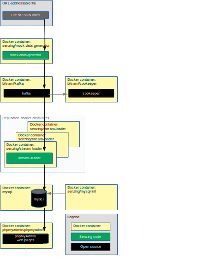

# docker-compose-stream-loader-kafka-demo

## Overview



------


This docker formation brings up the following docker containers:

1. *[bitnami/zookeeper](https://github.com/bitnami/bitnami-docker-zookeeper)*
1. *[bitnami/kafka](https://github.com/bitnami/bitnami-docker-kafka)*
1. *[mysql](https://github.com/docker-library/mysql)*
1. *[phpmyadmin/phpmyadmin](https://github.com/phpmyadmin/docker)*
1. *[senzing/mock-data-generator](https://github.com/Senzing/mock-data-generator)*
1. *[senzing/mysql-init](https://github.com/Senzing/docker-mysql-init)*
1. *[senzing/python-base](https://github.com/Senzing/docker-python-base)*
1. *[senzing/stream-loader](https://github.com/Senzing/stream-loader)*

### Contents

## Preparation

### Set environment variables

1. These variables may be modified, but do not need to be modified.
   The variables are used throughout the installation procedure.

    ```console
    export GIT_ACCOUNT=senzing
    export GIT_REPOSITORY=docker-compose-stream-loader-kafka-demo
    ```

1. Synthesize environment variables.

    ```console
    export GIT_ACCOUNT_DIR=~/${GIT_ACCOUNT}.git
    export GIT_REPOSITORY_DIR="${GIT_ACCOUNT_DIR}/${GIT_REPOSITORY}"
    export GIT_REPOSITORY_URL="https://github.com/${GIT_ACCOUNT}/${GIT_REPOSITORY}.git"
    ```

### Clone repository

1. Get repository.

    ```console
    mkdir --parents ${GIT_ACCOUNT_DIR}
    cd  ${GIT_ACCOUNT_DIR}
    git clone ${GIT_REPOSITORY_URL}
    ```

### Create SENZING_DIR

If you do not already have an `/opt/senzing` directory on your local system, visit
[HOWTO - Create SENZING_DIR](https://github.com/Senzing/knowledge-base/blob/master/HOWTO/create-senzing-dir.md).

### Software

The following software programs need to be installed.

#### docker

```console
sudo docker --version
sudo docker run hello-world
```

#### docker-compose

```console
sudo docker-compose --version
```

## Using docker-compose

### Build docker images

1. Build docker images.

    ```console
    sudo docker build --tag senzing/python-base         https://github.com/senzing/docker-python-base.git
    sudo docker build --tag senzing/mock-data-generator https://github.com/senzing/mock-data-generator.git
    sudo docker build --tag senzing/mysql-init          https://github.com/senzing/docker-mysql-init.git
    sudo docker build --tag senzing/stream-loader       https://github.com/senzing/stream-loader.git
    ```

### Configuration

- **SENZING_DIR** -
  Path on the local system where
  [Senzing_API.tgz](https://s3.amazonaws.com/public-read-access/SenzingComDownloads/Senzing_API.tgz)
  has been extracted.
  See [Create SENZING_DIR](#create-senzing_dir).
  No default.
  Usually set to "/opt/senzing".
- **MYSQL_ROOT_PASSWORD** -
  The password for the the database "root" user name.
  Default: "root"
- **MYSQL_STORAGE** -
  Path on local system where the database files are stored.
  Default: "/storage/docker/senzing/docker-compose-mysql-demo"
- See [github.com/Senzing/docker-mysql](https://github.com/Senzing/docker-mysql)
  for more details on how to find values for other **MYSQL_** environment variables.

### Run docker formation to initialize database

1. Launch docker-compose formation.  Example:

    ```console
    cd ${GIT_REPOSITORY_DIR}

    export SENZING_DIR=/opt/senzing

    export MYSQL_DATABASE=G2
    export MYSQL_ROOT_PASSWORD=root
    export MYSQL_USERNAME=g2
    export MYSQL_PASSWORD=g2
    export MYSQL_STORAGE=/storage/docker/senzing/docker-compose-stream-loader-kafka-demo

    sudo docker-compose --file docker-compose-init.yaml up
    ```

1. Once docker formation is up, phpMyAdmin will be available at
   [localhost:8080](http://localhost:8080).
   You can log in with Username "root" and the Password specified in `MYSQL_ROOT_PASSWORD`.

1. The database storage will persist on the local system at ${MYSQL_STORAGE}.
   The default database storage path is `/storage/docker/senzing/docker-compose-stream-loader-kafka-demo`.

1. When the following is seen in the log:

    ```console
    senzing-mysql-init exited with code 0
    ```

    the docker formation can be brought down.

    ```console
    cd ${GIT_REPOSITORY_DIR}
    sudo docker-compose --file docker-compose-init.yaml down
    ```

### Run docker formation to read from Kafka

1. Launch docker-compose formation.

    ```console
    cd ${GIT_REPOSITORY_DIR}

    export SENZING_DIR=/opt/senzing

    export MYSQL_DATABASE=G2
    export MYSQL_ROOT_PASSWORD=root
    export MYSQL_USERNAME=g2
    export MYSQL_PASSWORD=g2
    export MYSQL_STORAGE=/storage/docker/senzing/docker-compose-stream-loader-kafka-demo

    sudo docker-compose --file docker-compose-kafka.yaml up
    ```

1. Once docker formation is up, phpMyAdmin will be available at
   [localhost:8080](http://localhost:8080).
   The records received from Kafka can be viewed in the following Senzing tables:
    1. G2 > DSRC_RECORD
    1. G2 > OBS_ENT

## Cleanup

In a separate (or reusable) terminal window:

1. Use environment variable describe in "[Set environment variables](#set-environment-variables)" and "[Configuration](#configuration)".
1. Run `docker-compose` command.

    ```console
    cd ${GIT_REPOSITORY_DIR}
    sudo docker-compose --file docker-compose-kafka.yaml down
    ```

1. Delete database storage.

    ```console
    sudo rm -rf ${MYSQL_STORAGE}
    ```

1. Delete SENZING_DIR.

    ```console
    sudo rm -rf ${SENZING_DIR}
    ```

1. Delete git repository.

    ```console
    sudo rm -rf ${GIT_REPOSITORY_DIR}
    ```
