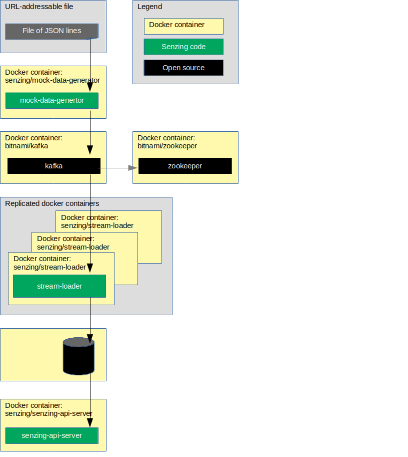

# docker-compose-stream-loader-kafka-demo

## Overview

The following diagram shows the relationship of the docker containers in this docker composition.

Implementations of the docker formation:

1. [Using mySQL database](docs/docker-compose-stream-loader-kafka-mysql/README.md)
1. [Using SqLite database](docs/docker-compose-stream-loader-kafka-sqlite/README.md)
1. [Using PostgreSQL database](docs/docker-compose-stream-loader-kafka-postgresql/README.md)
