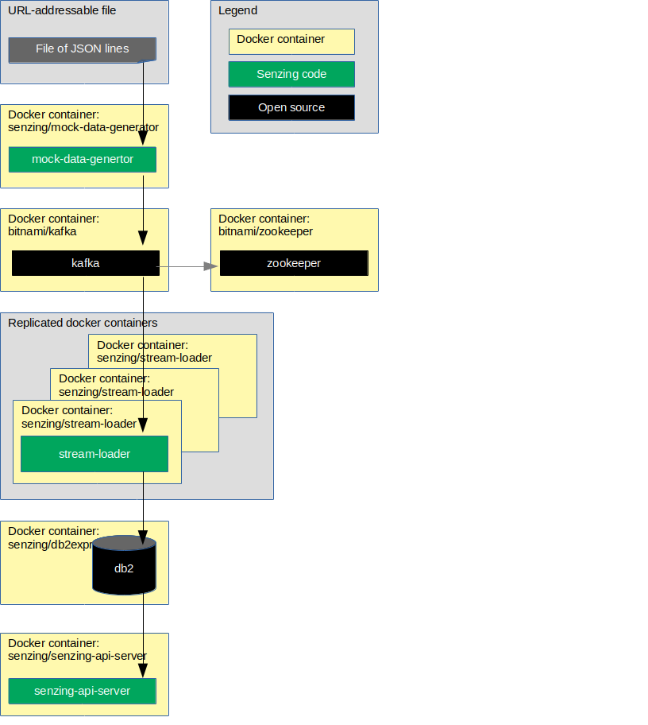

# docker-compose-stream-loader-kafka-db2

## Overview

The following diagram shows the relationship of the docker containers in this docker composition.



This docker formation brings up the following docker containers:

1. *[bitnami/zookeeper](https://github.com/bitnami/bitnami-docker-zookeeper)*
1. *[bitnami/kafka](https://github.com/bitnami/bitnami-docker-kafka)*
1. *[senzing/db2express-c](https://github.com/Senzing/docker-db2express-c)*
1. *[senzing/mock-data-generator](https://github.com/Senzing/mock-data-generator)*
1. *[senzing/senzing-base](https://github.com/Senzing/docker-senzing-base)*
1. *[senzing/stream-loader](https://github.com/Senzing/stream-loader)*
1. *[senzing/senzing-api-server](https://github.com/Senzing/senzing-api-server)*

### Contents

1. [Expectations](#expectations)
    1. [Space](#space)
    1. [Time](#time)
    1. [Background knowledge](#background-knowledge)
1. [Preparation](#preparation)
    1. [Prerequisite software](#prerequisite-software)
    1. [Clone repository](#clone-repository)
    1. [Create SENZING_DIR](#create-senzing_dir)
1. [Using docker-compose](#using-docker-compose)
    1. [Build docker images](#build-docker-images)
    1. [Configuration](#configuration)
    1. [Run docker formation to read from Kafka](#run-docker-formation-to-read-from-kafka)
    1. [Initialize database](#initialize-database)
    1. [Test Docker container](#test-docker-container)
1. [Cleanup](#cleanup)

## Expectations

### Space

This repository and demonstration require 7 GB free disk space.

### Time

Budget 2 hours to get the demonstration up-and-running, depending on CPU and network speeds.

### Background knowledge

This repository assumes a working knowledge of:

1. [Docker](https://github.com/Senzing/knowledge-base/blob/master/WHATIS/docker.md)
1. [Docker-compose](https://github.com/Senzing/knowledge-base/blob/master/WHATIS/docker-compose.md)

## Preparation

### Prerequisite software

The following software programs need to be installed:

1. [docker](https://github.com/Senzing/knowledge-base/blob/master/HOWTO/install-docker.md)
1. [docker-compose](https://github.com/Senzing/knowledge-base/blob/master/HOWTO/install-docker-compose.md)

### Clone repository

1. Set these environment variable values:

    ```console
    export GIT_ACCOUNT=senzing
    export GIT_REPOSITORY=docker-compose-stream-loader-kafka-demo
    ```

   Then follow steps in [clone-repository](https://github.com/Senzing/knowledge-base/blob/master/HOWTO/clone-repository.md).

1. After the repository has been cloned, be sure the following are set:

    ```console
    export GIT_ACCOUNT_DIR=~/${GIT_ACCOUNT}.git
    export GIT_REPOSITORY_DIR="${GIT_ACCOUNT_DIR}/${GIT_REPOSITORY}"
    ```

### Create SENZING_DIR

If you do not already have an `/opt/senzing` directory on your local system, visit
[HOWTO - Create SENZING_DIR](https://github.com/Senzing/knowledge-base/blob/master/HOWTO/create-senzing-dir.md).

## Using docker-compose

### Build docker images

1. Build [senzing/senzing-base](https://github.com/Senzing/docker-senzing-base) docker image.

1. Build docker images.

    ```console
    sudo docker build --tag senzing/db2express-c        https://github.com/senzing/docker-db2express-c.git
    sudo docker build --tag senzing/stream-loader       https://github.com/senzing/stream-loader.git
    sudo docker build --tag senzing/mock-data-generator https://github.com/senzing/mock-data-generator.git
    ```

1. Build [senzing/senzing-api-server](https://github.com/Senzing/senzing-api-server#using-docker) docker image.

### Configuration

- **SENZING_DIR** -
  Path on the local system where
  [Senzing_API.tgz](https://s3.amazonaws.com/public-read-access/SenzingComDownloads/Senzing_API.tgz)
  has been extracted.
  See [Create SENZING_DIR](#create-senzing_dir).
  No default.
  Usually set to "/opt/senzing".
- **DB2_DB** -
  The database schema name.
  Default: "G2"
- **DB2_PASSWORD** -
  The password for the the database "root" user name.
  Default: "db2inst"  
- **DB2_USERNAME** -
  The username for the the database "root" user name.
  Default: "db2inst2"  
- **DB2_STORAGE** -
  Path on local system where the database files are stored.
  Default: "/storage/docker/senzing/docker-compose-stream-loader-kafka-db2"

### Run docker formation to read from Kafka

1. Launch docker-compose formation.

    ```console
    cd ${GIT_REPOSITORY_DIR}

    export SENZING_DIR=/opt/senzing

    export DB2_DB=G2
    export DB2_PASSWORD=db2inst1
    export DB2_USERNAME=db2inst1
    export DB2_STORAGE=/storage/docker/senzing/docker-compose-stream-loader-kafka-db2

    sudo docker-compose --file docker-compose-db2-kafka.yaml up
    ```

### Initialize database

1. Populate database. In `senzing-db2` docker container, run

    ```console
    su - db2inst1
    db2 create database g2 using codeset utf-8 territory us
    db2 connect to g2
    db2 -tf /opt/senzing/g2/data/g2core-schema-db2-create.sql | tee /tmp/g2schema.out
    db2 connect reset
    ```

### Test Docker container

1. Wait for the following message in the terminal showing docker log.

    ```console
    senzing-api-server | Started Senzing REST API Server on port 8080.
    senzing-api-server |
    senzing-api-server | Server running at:
    senzing-api-server | http://0.0.0.0:8080/
    ```

1. Test Senzing REST API server.
   *Note:* port 8889 on the localhost has been mapped to port 8080 in the docker container.
   See `WEBAPP_PORT` definition.
   Example:

    ```console
    export SENZING_API_SERVICE=http://localhost:8889

    curl -X GET ${SENZING_API_SERVICE}/heartbeat
    curl -X GET ${SENZING_API_SERVICE}/license
    curl -X GET ${SENZING_API_SERVICE}/entities/1
    ```

## Cleanup

In a separate (or reusable) terminal window:

1. Use environment variable describe in "[Clone repository](#clone-repository)" and "[Configuration](#configuration)".
1. Run `docker-compose` command.

    ```console
    cd ${GIT_REPOSITORY_DIR}
    sudo docker-compose --file docker-compose-db2-kafka.yaml down
    ```

1. Delete database storage.

    ```console
    sudo rm -rf ${DB2_STORAGE}
    ```

1. Delete SENZING_DIR.

    ```console
    sudo rm -rf ${SENZING_DIR}
    ```

1. Delete git repository.

    ```console
    sudo rm -rf ${GIT_REPOSITORY_DIR}
    ```
